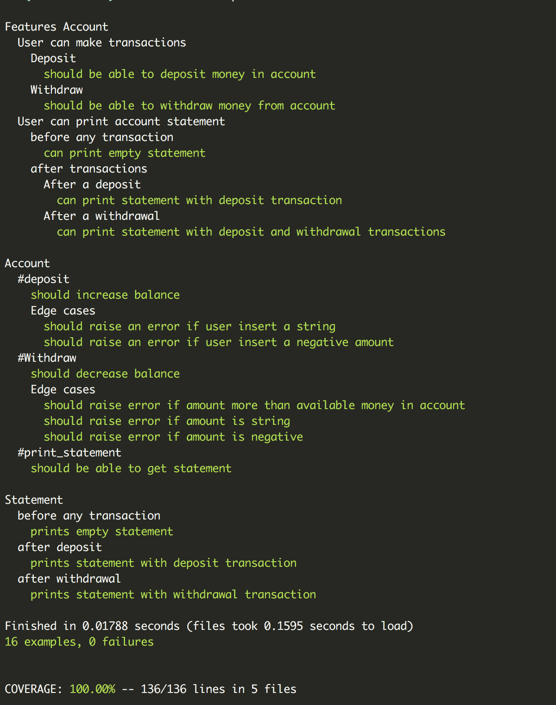

# Bank tech test

[Motivation](#motivation) | [Build status](#build-status) | [Technologies](#technologies) | [User Stories](#user-stories) | [Running the App](#running-the-app) | [Running tests](#running-tests) | [Approach](#approach) | [Contributing](#contributing)

----
A simple command-line banking application done in Ruby using Object Oriented Design(OOD) and Test driven development(TDD).

##  <a name="motivation">**Motivation**</a>

This project was created for a technical test challenge at Makers Academy.

##  <a name="build-status">**Build Status**</a>

[](https://travis-ci.org/m-rcd/bank-tech-test)

##  <a name="technologies">**Technologies**</a>

- Ruby
- RSpec
- Rubocop
- Simplecov

##  <a name="user-stories">**User stories**</a>

```
As a user
So that I can save money
I can deposit money in my account
```

```
As a user
So that I can spend money
I can withdraw money from my account
```

```
As a user
So that I can check my account history
I can print a statement showing all my transactions
```


##  <a name="running-the-app">**Running the app**</a>

- Clone this repository:
   `git clone https://github.com/m-rcd/bank-tech-test/`

- Go into the repository: `cd bank-tech-test`

- Run `bundle install`

- In the command line, run `pry` or `irb`


```rb
[1] pry(main)> require './lib/account.rb'
=> true
[2] pry(main)> require './lib/statement.rb'
=> true
[3] pry(main)> account = Account.new
=> #<Account:0x00007fe47c0dcd30 @balance=0, @statement=#<Statement:0x00007fe47c0dcd08>, @transactions=#<Transactions:0x00007fe47c0dcce0 @history=[]>>
[4] pry(main)> account.deposit(1000)
=> [{:date=>"06/11/2018", :credit=>"1000.00", :balance=>"1000.00", :type=>"credit"}]
[5] pry(main)> account.deposit(2000)
=> [{:date=>"06/11/2018", :credit=>"1000.00", :balance=>"1000.00", :type=>"credit"}, {:date=>"06/11/2018", :credit=>"2000.00", :balance=>"3000.00", :type=>"credit"}]
[6] pry(main)> account.withdraw(500)
=> [{:date=>"06/11/2018", :credit=>"1000.00", :balance=>"1000.00", :type=>"credit"},
 {:date=>"06/11/2018", :credit=>"2000.00", :balance=>"3000.00", :type=>"credit"},
 {:date=>"06/11/2018", :debit=>"500.00", :balance=>"2500.00", :type=>"debit"}]
[7] pry(main)> account.print_statement
Date || Credit || Debit || Balance
06/11/2018 || || 500.00 || 2500.00
06/11/2018 || 2000.00 || || 3000.00
06/11/2018 || 1000.00 || || 1000.00
```

##  <a name="running-tests">**Running tests**</a>

Run `rspec` in your terminal



##  <a name="approach">**Approach**</a>

- I used TDD while solving this challenge

- I started with one class account that keeps track of balance and allows a user to deposit and withdraw money and a statement class that return a statement.

- I then decided that the class account has too many responsibilities. I therefore created a third class which is responsible for deposits and withdrawal.

- After receiving feedback from Mark, I moved the formatting of price and date from transactions class to statement class. This left the transactions class with no behaviours. I therefore removed the transactions class after moving the history array to the account class.

- I tested for edge cases such as:
  - User cannot enter a negative amount or a string
  - User cannot withdraw more than available money in their account.


##  <a name="contributing">**Contributing**</a>

Pull Requests are always welcome.

When you edit the code, please run bundle exec rspec to check all the tests pass.
Also run the linter rubocop  before you git commit.

Ensure the PR description clearly describes the problem and solution. It should include the relevant issue number, if applicable.
